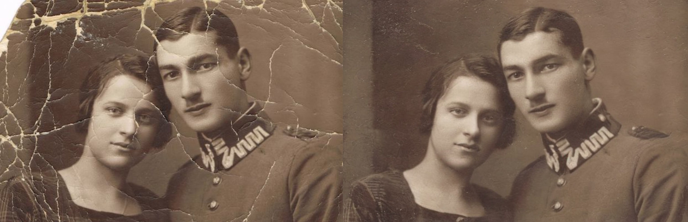
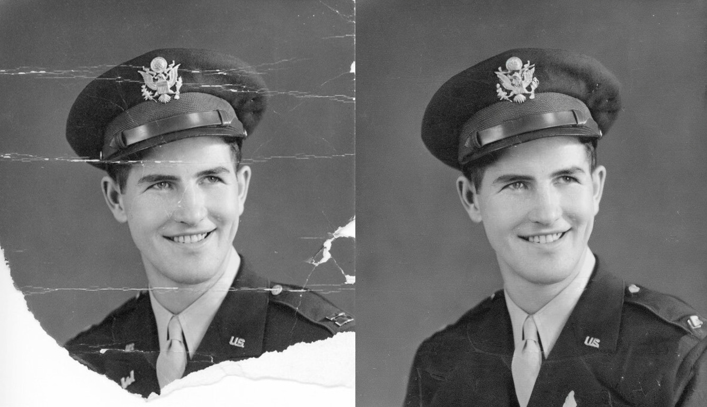

# UnpromptedControl

ControlNet is a highly regarded tool for guiding StableDiffusion models, and it has been widely acknowledged for its effectiveness. In this repository, I have discovered a technique that allows for the restoration or removal of objects without requiring user prompts. By leveraging this approach, the workflow can be significantly streamlined, leading to enhanced process efficiency.

## Image Restoration 

In this image restoration is accomplished using the controlnet-canny and stable-diffusion-2-inpainting techniques, with only "" blank input prompts. Additionally, for automatic scratch segmentation, the FT_Epoch_latest.pt model is being used. However, if the segmentation output is not satisfactory, it is possible to manually sketch and refine the mask to achieve better results.

